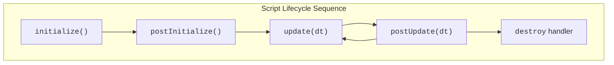

import Tabs from '@theme/Tabs';
import TabItem from '@theme/TabItem';

Every script instance you attach to an Entity in PlayCanvas goes through a well-defined lifecycle. Understanding this lifecycle is crucial because it dictates when your code runs and how it can interact with the rest of your application. PlayCanvas provides specific functions, called lifecycle methods, that you can define in your script. The engine will automatically call these methods at the appropriate times.

Think of it like the stages in an actor's performance: preparing backstage (`initialize`), performing on stage (`update`), and taking a final bow (`destroy` event).



## Lifecycle Methods

Let's break down each of the key lifecycle methods.

### `initialize()`

**When it's called:**

* Once per script instance.
* After the script instance is created and its Entity is enabled.
* After all its Script Attributes have been parsed and assigned their initial values (either defaults or values set in the Editor).

**Purpose:**

* This is your script's primary setup or "constructor-like" phase.
* Ideal for:
    * Subscribing to script [lifecycle events](#lifecycle-events).
    * Registering [DOM event](https://developer.mozilla.org/en-US/docs/Web/Events) handlers.
    * Creating any objects the script needs to manage internally.
    * Caching references to other Entities in the scene hierarchy.

**Example:**

<Tabs>
<TabItem value="esm" label="ESM">

```javascript
import { Script } from 'playcanvas';

export class MyScript extends Script {
    static scriptName = 'myScript';

    initialize() {
        // Subscribe to some script lifecycle events
        this.on('enable', () => {
            console.log('script enabled');
        })
        this.on('disable', () => {
            console.log('script disabled');
        })
        this.once('destroy', () => {
            console.log('script destroyed');
        });
    }
}
```

</TabItem>
<TabItem value="classic" label="Classic">

```javascript
var MyScript = pc.createScript('myScript');

MyScript.prototype.initialize = function() {
    // Subscribe to some script lifecycle events
    this.on('enable', () => {
        console.log('script enabled');
    })
    this.on('disable', () => {
        console.log('script disabled');
    })
    this.once('destroy', () => {
        console.log('script destroyed');
    });
};
```

</TabItem>
</Tabs>

### `postInitialize()`

**When it's called:**

* Once per script instance.
* Called after the `initialize()` method of all script instances on all enabled Entities in the scene has completed.

**Purpose:**

* Useful for setup logic that depends on other scripts or Entities having already completed their own `initialize()` phase.
* Helps avoid race conditions where one script tries to access another script's properties before that other script has set them up.

:::warn

Avoid using the `constructor` for startup logic — use `initialize()` instead. Execution order of `constructor`s is not guaranteed.

:::

**Example:**

<Tabs>
<TabItem value="esm" label="ESM">

```javascript
import { Script } from 'playcanvas';

export class MyScript extends Script {
    static scriptName = 'myScript';

    initialize() {
        // Get a reference to another entity in the scene hierarchy
        this.otherEntity = this.app.root.findByName('OtherEntity');

        // Let's assume that when the initialize method of OtherEntity runs,
        // it allocates a property called 'material'. At this point, we cannot
        // be sure that OtherEntity's initialize method has executed...
    }

    postInitialize() {
        // But we can be sure it has executed by the time we get to here...
        const material = this.otherEntity.material;
    }
}
```

</TabItem>
<TabItem value="classic" label="Classic">

```javascript
var MyScript = pc.createScript('myScript');

MyScript.prototype.initialize = function() {
    // Get a reference to another entity in the scene hierarchy
    this.otherEntity = this.app.root.findByName('OtherEntity');

    // Let's assume that when the initialize method of OtherEntity runs,
    // it allocates a property called 'material'. At this point, we cannot
    // be sure that OtherEntity's initialize method has executed...
};

MyScript.prototype.postInitialize = function() {
    // But we can be sure it has executed by the time we get to here...
    const material = this.otherEntity.material;
};
```

</TabItem>
</Tabs>

### `update(dt)`

**When it's called:**

* Every frame, if the script instance, its Entity, and the Entity's ancestors are all enabled.

**Parameter:**

* dt (delta time): A number representing the time in seconds that has passed since the last frame. This is crucial for frame-rate independent logic.

**Purpose:**

* This is the heart of your script's runtime behavior.
* Used for:
    * Handling continuous input.
    * Updating positions, rotations, and scales for movement or animation.
    * Checking game conditions (e.g., collisions, win/loss states).
    * Any logic that needs to be performed repeatedly over time.

:::important

Keep update as efficient as possible, as it runs very frequently. Avoid heavy computations or allocations here if they can be done elsewhere (e.g., in initialize).

:::

**Example:**

<Tabs>
<TabItem value="esm" label="ESM">

```javascript
import { Script } from 'playcanvas';

export class Rotator extends Script {
    static scriptName = 'rotator';

    update(dt) {
        // Rotate the entity 10 degrees per second around the world Y axis
        this.entity.rotate(0, 10 * dt, 0);
    }
}
```

</TabItem>
<TabItem value="classic" label="Classic">

```javascript
var Rotator = pc.createScript('rotator');

Rotator.prototype.update = function(dt) {
    // Rotate the entity 10 degrees per second around the world Y axis
    this.entity.rotate(0, 10 * dt, 0);
};
```

</TabItem>
</Tabs>

### `postUpdate(dt)`

**When it's called:**

* Every frame, if the script instance and its Entity are enabled.
* Called after the `update()` method of all script instances has completed for the current frame.

**Parameter:**

* dt (delta time): Same as in update().

**Purpose:**

* Useful for logic that needs to run after all primary updates have occurred.
* Common use case: A camera script that follows a player. The player's update moves the player, and the camera's `postUpdate` then adjusts the camera's position to follow the player's new location smoothly.

**Example:**

<Tabs>
<TabItem value="esm" label="ESM">

```javascript
import { Script } from 'playcanvas';

export class TrackingCamera extends Script {
    static scriptName = 'trackingCamera';

    initialize() {
        this.player = this.app.root.findByName('Player');
    }

    postUpdate(dt) {
        // We know the player's position has been updated by now...
        const playerPos = this.player.getPosition();
        this.entity.lookAt(playerPos);
    }
}
```

</TabItem>
<TabItem value="classic" label="Classic">

```javascript
var TrackingCamera = pc.createScript('trackingCamera');

TrackingCamera.prototype.initialize = function() {
    this.player = this.app.root.findByName('Player');
};

TrackingCamera.prototype.postUpdate = function(dt) {
    // We know the player's position has been updated by now...
    const playerPos = this.player.getPosition();
    this.entity.lookAt(playerPos);
};
```

</TabItem>
</Tabs>

## Lifecycle Events

Beyond the primary lifecycle methods (`initialize`, `postInitialize`, `update`, `postUpdate`), script instances also emit specific events at key moments in their lifecycle. You can subscribe to these events to execute custom logic when these state changes occur. This is particularly useful for managing resources, toggling behaviors, or performing final cleanup.

The three main lifecycle events are `enable`, `disable`, and `destroy`.

### `enable` Event

**When it's fired:**

* When a script instance becomes enabled. This can happen in several ways:
    * When the script is first initialized, if both the script component and its Entity start in an enabled state.
    * When `this.enabled` is set from false to true programmatically.
    * When the script's parent Entity (or an ancestor Entity) becomes enabled, and the script itself was already marked as enabled.

**Purpose:**

* To perform actions when a script becomes active after being inactive.
* Ideal for:
    * Re-enabling behaviors that were paused (e.g., resuming animations, re-registering event listeners that were removed on disable).
    * Updating visual states to reflect an active status.

**Subscribing:**

```javascript
// Typically inside initialize()...
this.on('enable', this.onEnable, this);
```

:::tip

If a script starts in an enabled state, the `enable` event fires during the initialization phase. If you need to ensure certain setup from `onScriptEnabled` also runs if the script starts enabled, you can call the handler directly in `initialize` after subscribing, guarded by an `if (this.enabled)` check.

:::

### `disable` Event

**When it's fired:**

* When a script instance becomes disabled. This can occur when:
    * `this.enabled` is set from `true` to `false` programmatically.
    * The script's parent Entity (or an ancestor Entity) becomes disabled.
    * Before the `destroy` event is fired (as a script is implicitly disabled before destruction).

**Purpose:**

* To perform actions when a script becomes inactive.
* Ideal for:
    * Pausing behaviors (e.g., stopping animations, unregistering event listeners that are only relevant when active).
    * Releasing temporary resources that are only needed when enabled.
    * Updating visual states to reflect an inactive status.

**Subscribing:**

```javascript
// Typically inside initialize()...
this.on('disable', this.onDisable, this);
```

### `destroy` Event

**When it's fired:**

* When the script instance is about to be destroyed. This happens when:
    * Its parent Entity is destroyed.
    * The Script Component containing this script instance is removed from the Entity.
    * The script instance itself is explicitly destroyed (e.g., `this.destroy()`, though less common for direct calls).

**Purpose:**

* This is your script's final cleanup phase. It's crucial for preventing memory leaks and ensuring a clean shutdown of the script's functionality.
* Essential for:
    * Unsubscribing from all events the script subscribed to (e.g., `this.app.off(...)`, `someEntity.off(...)`, `this.off(...)` for its own events).
    * Releasing any external resources or DOM elements the script might have created or holds references to.
    * Nullifying references to other objects to help the garbage collector.

**Subscribing:**

```javascript
// Typically inside initialize()...
this.once('destroy', this.onDestroy, this);
```

:::tip

It's common to use `this.once('destroy', ...)` because the `destroy` handler only needs to run once.

:::